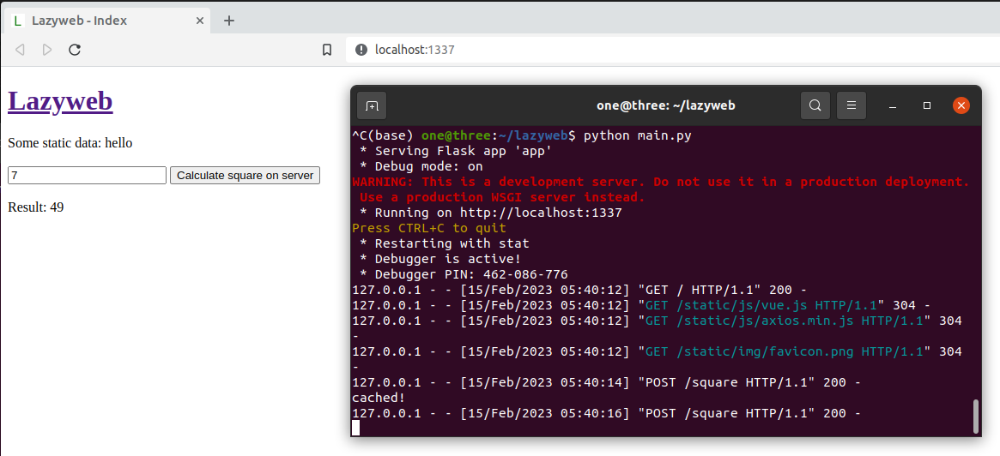

# Lazyweb

The laziest way I found so far for creating custom web apps



Tested with Python 3.9.12

## Download

```git clone https://github.com/void4/lazyweb.git```

## Install dependencies

```
cd lazyweb
python -m pip install -r requirements.txt
```

## Run

```python main.py```

## Used libraries

- Backend: [Python](https://www.python.org/)'s [Flask](https://flask.palletsprojects.com/en/2.2.x/quickstart/) (a web framework) and [Dataset](https://dataset.readthedocs.io/) (a high level SQLite database framework)

- Frontend: Javascript's [Vue](https://vuejs.org/guide/extras/ways-of-using-vue.html) (a framework for building user interfaces, in [standalone script](https://vuejs.org/guide/extras/ways-of-using-vue.html) configuration) and [Axios](https://github.com/axios/axios) (a high level interface for getting new data from the server without having to reload the page)

## Recommended tools

[DB Browser for SQLite](https://sqlitebrowser.org/) (for manual database.db inspection)
